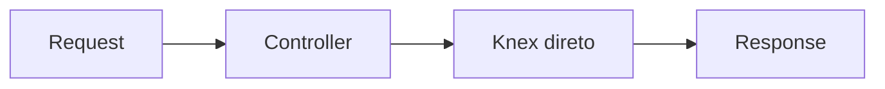
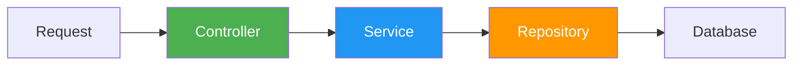
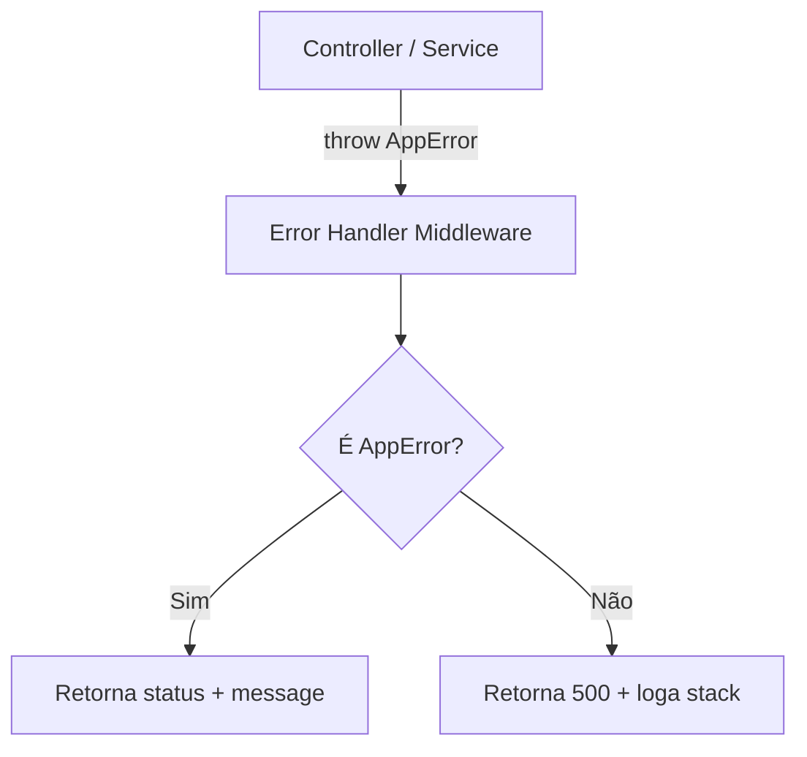
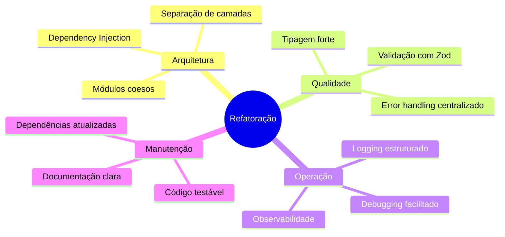

# Receitas Top API — Arquitetura & Decisões Técnicas

Documento explicativo sobre as mudanças propostas na refatoração e os ganhos de cada uma.

---

## 1. Separação em Camadas (Controller → Service → Repository)

### Como era
Os controllers faziam **tudo**: validavam dados, construíam queries SQL, gerenciavam transações, formatavam datas e montavam a resposta HTTP.



### Como fica



| Camada | Responsabilidade | Não deve |
|---|---|---|
| **Controller** | Extrair dados do request, chamar service, montar response | Ter lógica de negócio ou queries |
| **Service** | Regras de negócio, validações, orquestração | Conhecer `req`/`res` do Express |
| **Repository** | Queries ao banco (Knex) | Ter lógica de negócio |

### Ganho
- **Testabilidade**: Cada camada pode ser testada isoladamente (mock do repository no service, mock do service no controller)
- **Manutenibilidade**: Trocar o banco de dados exige mudanças apenas nos repositories
- **Clareza**: Novos desenvolvedores entendem imediatamente onde cada código vive

---

## 2. Dependency Injection (Manual)

### Como era
Os controllers instanciavam o Knex direto via `import`. Acoplamento total.

### Como fica
Cada classe recebe suas dependências pelo **construtor**:

```typescript
// Repository recebe a conexão Knex
class IngredienteRepository {
  constructor(private db: Knex) {}
}

// Service recebe o Repository
class IngredienteService {
  constructor(private repository: IngredienteRepository) {}
}

// Controller recebe o Service
class IngredienteController {
  constructor(private service: IngredienteService) {}
}
```

A composição é feita **uma vez** em [server.ts](file:///d:/dev/receitasTop/src/server.ts):

```typescript
const db = connection;
const ingredienteRepo = new IngredienteRepository(db);
const ingredienteService = new IngredienteService(ingredienteRepo);
const ingredienteController = new IngredienteController(ingredienteService);
```

### Ganho
- **Desacoplamento**: Nenhuma classe sabe como suas dependências são criadas
- **Facilidade de teste**: Basta passar um mock no construtor
- **Sem framework adicional**: Não precisa de inversify/tsyringe. É simples e explícito

---

## 3. DTOs + Validação com Zod

### Como era
Nenhuma validação no `req.body`. Qualquer payload inválido causava erros criptos do Postgres ou comportamento inesperado.

### Como fica
Schemas Zod definem o formato exato dos dados esperados:

```typescript
const CreateIngredienteDTO = z.object({
  descricao: z.string().min(1, 'Descrição é obrigatória'),
  unidade: z.string().min(1, 'Unidade é obrigatória'),
  quantidade: z.number().positive('Quantidade deve ser positiva'),
  preco: z.number().positive('Preço deve ser positivo'),
});
```

Um middleware genérico `validateBody(schema)` é aplicado nas rotas:

```typescript
router.post('/', validateBody(CreateIngredienteDTO), controller.create);
```

### Ganho
- **Segurança**: Dados inválidos são rejeitados antes de chegar ao banco
- **DX**: Mensagens de erro claras e em português
- **Tipagem automática**: `z.infer<typeof CreateIngredienteDTO>` gera o tipo TS automaticamente
- **Zero runtime overhead**: Zod é leve (~13kb) e não precisa de decorators

---

## 4. Error Handling Centralizado

### Como era
Cada controller tratava erros individualmente com `try/catch` inconsistentes. Alguns erros retornavam status 400, outros simplesmente retornavam o objeto de erro sem status code adequado.

### Como fica



Classes de erro tipadas:
- `AppError` — base com `statusCode`
- `NotFoundError` — 404
- `ValidationError` — 422 com detalhes dos campos

Resposta padronizada:
```json
{
  "status": "error",
  "message": "Ingrediente não encontrado",
  "statusCode": 404
}
```

### Ganho
- **Consistência**: Toda resposta de erro segue o mesmo formato
- **Menos boilerplate**: Controllers não precisam de `try/catch`
- **Debugging**: Erros inesperados são logados com stack trace completo
- **Segurança**: Erros internos nunca vazam para o cliente

---

## 5. Logging Estruturado (Pino)

### Como era
Sem nenhum logging. Se algo dava errado em produção, não havia como diagnosticar.

### Como fica
**Pino** produz logs em JSON (produção) ou formatado (desenvolvimento):

```
[11:05:20] INFO: → POST /ingrediente 201 12ms
[11:05:20] ERROR: Erro ao criar ingrediente {"error": "duplicate key", "stack": "..."}
```

### Por que Pino e não Winston?

| Critério | Pino | Winston |
|---|---|---|
| **Performance** | ~5x mais rápido | Mais lento |
| **Output** | JSON nativo | Precisa de formatters |
| **Tamanho** | ~150kb | ~500kb |
| **Complexidade** | Mínima | Mais configuração |

### Ganho
- **Observabilidade**: Saber exatamente o que acontece em produção
- **Integração**: JSON logs são ingestados por qualquer plataforma (Datadog, Elastic, CloudWatch)
- **Performance**: Pino não bloqueia o event loop

---

## 6. Middlewares Avançados

### Como era
Apenas `cors` e `express.json()`.

### Como fica

| Middleware | Função |
|---|---|
| `requestLogger` | Loga método, URL, status e tempo de resposta |
| `validateBody(schema)` | Valida `req.body` com um schema Zod |
| `errorHandler` | Captura erros e retorna resposta padronizada |

### Ordem de execução

```
Request → cors → json → requestLogger → rotas → errorHandler → Response
```

### Ganho
- **Separação de concerns**: Lógica cross-cutting fica nos middlewares, não nos controllers
- **Reusabilidade**: `validateBody` funciona com qualquer schema Zod
- **Debugging**: Cada request é logada automaticamente

---

## 7. Atualização de Dependências

### Por que atualizar?

| Pacote | Versão Atual | Problema |
|---|---|---|
| TypeScript 3.9 | Jun/2020 | Sem suporte a features modernas (satisfies, template literals, etc) |
| Knex 0.21 | Mai/2020 | Vulnerabilidades conhecidas, APIs depreciadas |
| Express 4.17.1 | Mai/2019 | Patches de segurança faltando |
| `dateformat` | — | Pacote abandonado, substituído por `date-fns` |

### Ganho
- **Segurança**: Patches de vulnerabilidades
- **DX**: TypeScript moderno com autocompletion e inferência melhores
- **Ecossistema**: Compatibilidade com bibliotecas atuais

---

## Resumo dos Ganhos



| Antes | Depois |
|---|---|
| Controllers com 200 linhas fazendo tudo | Controllers com ~30 linhas, apenas HTTP |
| Zero validação de input | Validação tipada com mensagens claras |
| Sem logging | Logs estruturados em JSON |
| Erros inconsistentes | Formato de erro padronizado |
| `try/catch` espalhados | Error handler centralizado |
| Dependências de 2020 | Stack atualizada e segura |
| Acoplamento total ao Knex | Repository pattern desacoplado |
| Impossível testar unitariamente | Cada camada testável isoladamente |
